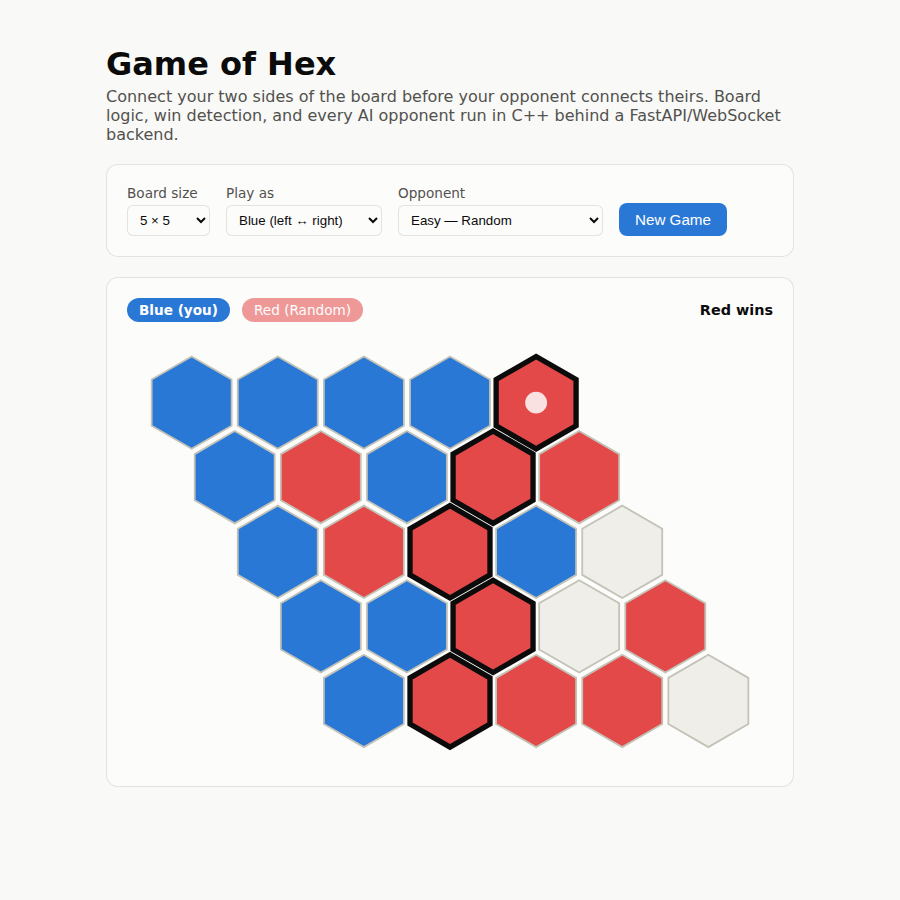

# Game of Hex

A C++ engine for the board game Hex — three AI opponents including a from-scratch
Monte Carlo Tree Search — behind a full-stack web app.



This started as a single-file console program (`hexupdated.cpp` in the git
history) with the board, the game loop, and a flat Monte Carlo AI all mixed
into a few functions that read from `cin` and wrote to `cout`. This version
keeps the same core idea — an n×n hex grid, connect your two edges before
your opponent connects theirs — but rebuilds it end to end:

- The board is a standalone, cloneable value type instead of console-coupled
  state, with the same six hex-neighbor offsets and edge-to-edge BFS win
  detection as the original, plus a reconstructed winning path for the
  frontend to highlight.
- `Game` is an I/O-free state machine — the original's `Game` class printed
  the board and prompted for input inside the same functions that applied
  moves, which is exactly what stood between it and a web frontend.
- The original's flat Monte Carlo AI is preserved (evaluate every empty cell
  by running random rollouts to a forced result — Hex can't draw once the
  board is full, so "fill in randomly and see who's connected" is a valid,
  if noisy, evaluator) with one bug fixed: its rollouts always started the
  random fill with a color fixed by which player was being evaluated,
  regardless of whose turn it actually was next. This version starts each
  rollout with the correct next player.
- A new **Monte Carlo Tree Search (UCT)** AI was added from scratch —
  selection, expansion, rollout, and backpropagation, spending its search
  budget on the moves that are actually working out instead of evaluating
  every cell equally.
- That engine is exposed to Python via [pybind11](https://pybind11.readthedocs.io/),
  wrapped in a FastAPI backend, and driven from a React frontend with an SVG
  hex board you play against any of the three AIs over a WebSocket.

## Architecture

```
┌─────────────┐   pybind11    ┌──────────────┐   REST / WebSocket   ┌─────────────┐
│  C++ engine │──────────────▶│   FastAPI    │◀─────────────────────│    React    │
│ board/game/ │  (GIL released│   backend    │   POST /api/games    │  frontend   │
│ ai (Random, │  during AI    │              │   WS /ws/games/{id}  │ (Vite + TS) │
│ FlatMC, MCTS)│  search)     │              │                      │ SVG hex grid│
└─────────────┘               └──────────────┘                      └─────────────┘
       ▲
       │ doctest
┌─────────────┐
│ engine tests│
└─────────────┘
```

- **engine/** — the domain model. `Board` owns the grid, placement, and
  BFS-based win/winning-path detection; `Game` is a thin turn-tracking state
  machine around it; `ai.hpp`/`ai.cpp` implement the `AIStrategy` interface
  with three subclasses: `RandomAI`, `FlatMonteCarloAI` (the original
  algorithm, turn-order bug fixed), and `MctsAI` (new). Zero dependency on
  Python or the web — it builds and tests standalone. `engine/tests/` is a
  vendored [doctest](https://github.com/doctest/doctest) suite: board
  win-detection edge cases (straight and zig-zag chains, broken chains),
  turn-order enforcement, an invariant check that every AI strategy only
  ever returns a currently-empty cell, and a statistical test that MCTS
  beats a random opponent by a wide, non-flaky margin.
- **engine/tools/benchmark.cpp** — a standalone CLI (`hex_benchmark
  [board_size] [games] [mcts_iterations] [flat_trials]`) used to produce the
  head-to-head numbers below with real game counts, not the smaller/faster
  budgets the test suite uses for CI.
- **engine/bindings/** — a pybind11 module (`hex_engine`) wrapping `Player`,
  `Board`, `Game`, and all three AI strategies. `select_move` releases the
  GIL for the duration of the search, so a multi-thousand-iteration MCTS
  call on a FastAPI worker thread doesn't stall the event loop.
- **backend/** — FastAPI. `POST /api/games` creates a session (an in-memory
  `GameSession` — this is a portfolio-scale demo, not a persistent
  matchmaking service) and plays the AI's opening move if the human chose
  Red. `WS /ws/games/{id}` takes `{row, col}` moves, applies them, and — via
  `asyncio.to_thread` so the AI's search doesn't block other games' sockets
  — plays the AI's reply.
- **frontend/** — React + TypeScript (Vite). An SVG pointy-top hex grid
  (`HexBoard.tsx`) computes hex centers and corner points directly from
  board coordinates, colors cells by side, and outlines the winning path in
  bold once the game ends. A setup panel picks board size, side, and
  difficulty (Easy = Random, Medium = Flat Monte Carlo, Hard = MCTS).

## AI benchmark

Run with `./build/engine/hex_benchmark 7 100 4000 100` (7×7 board, 100 games
per matchup, MCTS given 4000 iterations per move, Flat Monte Carlo given 100
rollouts per empty cell — roughly matched total rollout budgets per move):

| Matchup | Result |
|---|---|
| MCTS vs. Random | 100 – 0 |
| Flat Monte Carlo vs. Random | 100 – 0 |
| MCTS vs. Flat Monte Carlo | 56 – 44 |

Both Monte Carlo methods dominate a random opponent, as expected. The
closer MCTS-vs-Flat-Monte-Carlo result is the honest one: at a matched
rollout budget, spending that budget on tree search instead of evaluating
every cell equally is a real but modest edge on a 7×7 board, not a
blowout — which is in line with what the literature on small-board Hex
would predict.

## Running it

**Docker (recommended):**

```bash
docker compose up --build
```

Then open <http://localhost:8081>. The frontend container serves the built
React app via nginx and proxies `/api` and `/ws` to the backend container.
(Poker-Probability's compose file uses port 8080 — 8081 here so both apps
can run side by side.)

**Locally, without Docker:**

```bash
# 1. Build the C++ engine, run its tests, and build the pybind11 module
pip install pybind11
./engine/build.sh

# 2. Backend
cd backend
python3 -m venv .venv && source .venv/bin/activate
pip install -r requirements.txt
python -m pytest tests/ -v
uvicorn app.main:app --reload

# 3. Frontend (separate terminal)
cd frontend
npm install
npm run dev
```

The frontend dev server proxies `/api` and `/ws` to `localhost:8000` (see
`frontend/vite.config.ts`), so run the backend first.

## Testing

- `./build/engine/hex_engine_tests` — C++ unit + statistical tests (doctest,
  10 cases / 360 assertions)
- `cd backend && python -m pytest tests/ -v` — API tests, including a full
  WebSocket playthrough on a 3×3 board and illegal-move rejection
- `cd frontend && npm run build` — type-checks and builds the frontend

All three run on every push via GitHub Actions (`.github/workflows/ci.yml`),
along with a build of both Docker images.

## Why a C++ core behind a Python API

The interesting part of this project is the AI search code, and search code
is exactly where a systems language earns its keep — MCTS on even a small
board runs thousands of simulated playouts per move. Rewriting that in pure
Python for the web would have made the "hard" AI slow enough to need
compromises on iteration count. Instead the C++ stays the actual engine —
pybind11 is a boundary, not a rewrite — so the web app plays against the
same, tested search code as the standalone benchmark tool, at the same
budgets, with the GIL released for the duration so it doesn't cost the
server anything else that's running.
